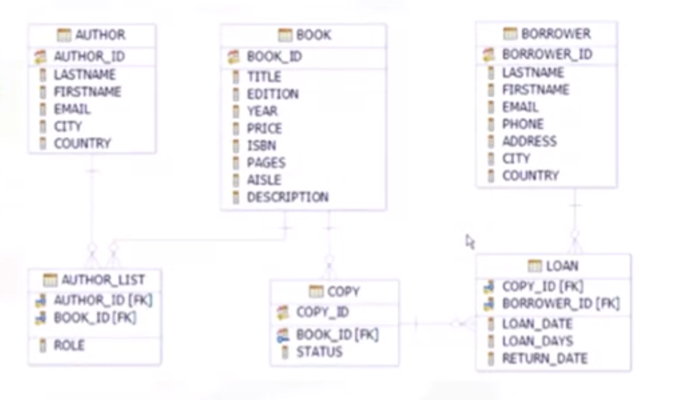
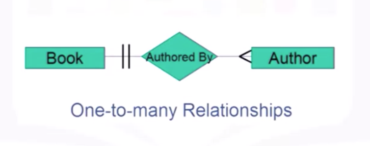
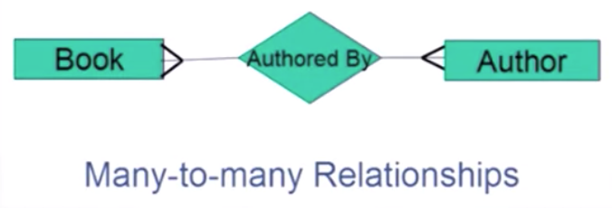
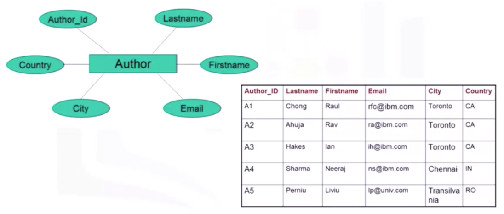

# [Week 1](https://www.coursera.org/learn/sql-data-science/home/week/1) - Introduction to Databases

## 1-1. Introduction to Databases

- Course 목표: SQL basics, aspects of the relational database model
- 이 강의 목표: Describe SQL, data, database, relational database. 5 basic SQL commands

### SQL이란?

Relational database를 위한 언어로, 데이터베이스에서 데이터를 쿼리하는 데 사용되는 언어.

### 데이터란?

데이터는 많은 비지니스에서 중요하므로, 보안 및 신속한 저장 및 액세스가 필요함. 이를 위한 프로그램이 데이터베이스.

### 데이터베이스

데이터베이스는 data의 repository. 데이터를 저장하는 것 뿐만 아니라, 데이터를 추가, 수정 및 쿼리하는 기능을 제공함.

데이터베이스는 다양한 형식으로 데이터를 저장하는데, 행과 열의 테이블 형식으로 저장되면 관계형 데이터베이스(relational database)라고 한다.

### RDBMS

RDBMS = Relational database management system

데이터를 제어하는 소프트웨어의 집합이다. RDBMS의 예로는 mySQL, Oracle 등이 있다.

### Basic SQL Commands

기본적으로 CREATE,INSERT,SELECT,UPDATE,DELETE 5가지의 기능을 제공한다.


## How to create a Database instance on Cloud

SQL을 배우기 위해서는, SQL 쿼리를 연습해볼 수 있는 database가 필요하다.

이 강의에서는 IBM Db2를 이용해 클라우드에 free instance of a database를 만들고, SQL queries를 테스트 해볼 것.

### Cloud database

클라우드를 통해 구축되어 엑세스하는 데이터베이스 서비스로, 기존 DB에서 Cloud computing의 유연성이 더해진 형태이다.

사용 용이성, 확장성, 재해 복구 등의 장점이 있다.

대표적인 클라우드 데이터베이스에는 IBM DB2 on Cloud, Compose database for postgreSQL, Microsoft Azure SQL database 등이 있다.


## 1-2. Basic SQL

[복습] 5가지 기본 명령문 - CREATE,INSERT,SELECT,UPDATE,DELETE

DDL (Data definition language) - 데이터를 정의, 변경, 혹은 삭제한다.

DML (Data manipulation language) - 데이터를 읽고, 수정한다.

### CREATE TABLE statement

DDL 명령어 중 하나인 CREATE는 엔티티의 이름을 사용해 테이블을 생성하고, 엔티티의 속성을 사용해 테이블의 열을 구성한다.

각각의 테이블 속성에는 데이터 유형이 지정된다. 데이터 유형의 예로는 char (고정 길이 문자열), varchar (가변 길이 문자열), integer 등이 있다.

Primary key는 중복을 허용하지 않음으로써 테이블의 각 row를 unique 하게 식별한다.

**syntax**

```sql
create table TABLENAME (
    COLUMN1 datatype,
    COLUMN2 datatype,
    COLUMN3 datatype,
        ...
    ) ;
```

예를 들어, integer type의 ID, varchar type의 NAME 속성을 가진 TEST 테이블은 아래와 같이 만들 수 있다.

```sql
create table TEST (
  	ID int,
  	NAME varchar(30)
);
```

create table 명령문에는 Type 외에도 아래와 같은 키워드들이 있다.

```sql
create table COUNTRY (
		ID int NOT NULL,
  	CCODE char(2),
  	NAME varchar(60),
  	PRIMARY KEY (ID)
);
```

데이터 형식 뒤에 붙은 `NOT NULL` 제한자는 해당 속성이 NULL 또는 빈 값을 가질 수 없음을 의미한다.

마지막 속성에서 ID를 PRIMARY KEY로 사용하고 있다. Primay Key는 null 값을 가질 수 없고, 테이블에서 unique 해야 한다. primary key를 이용하면 쿼리를 요청 할 수 있다.

### DROP TABLE statement

데이터베이스에 이미 있는 테이블을 CREATE 하려고 하면 에러가 나는데, 이를 해결하기 위해서는 다른 이름의 테이블을 만들거나, 아래와 같이 기존 테이블을 DROP 한 뒤 CREATE 해야 한다.

```sql
drop table COUNTRY;
create table COUNTRY (
    ID integer PRIMARY KEY NOT NULL,
    CCODE char(2),
    NAME varchar(60)
    );
```

### SELECT Statement

DBMS의 주요 목적은 데이터 저장 뿐만 아니라, 데이터를 쉽게 검색하는 것이다. DML 명령문 중 하나인 **SELECT** 문을 사용해 테이블의 열을 선택하여 데이터를 검색할 수 있다.

SELECT 문을 query라고 하며, 이 쿼리를 실행하여 얻은 output을 result set, 또는 result table 이라고 한다.

Select 문의 가장 간단한 형태는 아래와 같다.

```sql
select * from Book
```

`*` 를 사용하면 테이블의 모든 행을 가져온다.

특정 열만 검색하고 싶다면 검색을 원하는 열들만 명시하면 된다. 검색 결과 column들은 반드시 Select 명령문에서 적은 순서를 따른다.

```sql
select book_id, title, price from Book
```

그런데 만약, book_id가 1인 행만 가져오고 싶다면?

이렇게 검색 결과에 조건을 두고 싶을 때 사용하는 것이 **WHERE** 이다. WHERE은 항상 조건절이 필요한데, 조건자는 true, false 또는 unknown으로 평가된다.

```sql
select book_id, title, price from Book WHERE book_id="B1"
```

조건절에는 위에서 사용한 `=` 이외에도 다양한 비교 연산자를 사용할 수 있다.


[사진 출처](https://www.coursera.org/learn/sql-data-science/lecture/OkQB1/select-statement)

#### COUNT, DISTINCT, LIMIT

Select 문과 함께 사용되는 몇 가지 유용한 표현식들.

1) COUNT

count는 쿼리 기준을 충족하는 **행의 갯수**를 검색하는 기능이다.

- 테이블의 행 갯수 얻기

```sql
select COUNT(*) from tablename
```

- MEDAL 테이블에서 Country = "CANADA" 인 행의 수 얻기

```sql
select COUNT(COUNTRY) from MEDALS where COUNTRY="CANANDA"
```

2) DISTINCT

distinct는 결과 값에서 중복 값을 제거하는 기능이다.

- 특정 열에서 unique한 값들의 리스트를 얻기

```sql
select DISTINCT columnname from tablename
```

- GOLD 메달을 받은 unique한 나라들의 리스트를 얻기

```sql
select DISTINCT COUNTRY from MEDALS where MEDALTYPE = "GOLD"
```

3) LIMIT

데이터베이스에서 검색 결과의 행 수를 제한하는 기능 - 매우 클 수도 있는 전체 검색결과가 아니라, 일부만 보고 판단하고 싶을 때 유용함

- 테이블에서 처음 10개의 행만 얻기

```sql
select * from tablename LIMIT 10
```

- 2018년에서 5개의 행만 얻기

```sql
select * from MEDALS where YEAR = 2018 LIMIT 5
```

#### INSERT Statement

Create 를 통해 테이블을 생성한 후, 데이터(=row)를 채우기 위해 DML 명령문 중 하나인 **Insert** 문을 사용한다. 

**syntax**

```sql
INSERT INTO tablename (columnname,...) VALUES [(row1_value,...),(row2_value...),....]
```

columnname과 value의 데이터들은 `,` 로 구분한다. columnname에 적은 갯수와, value에 적은 갯수가 동일해야 한다.

한 번에 한 행씩 추가할 필요는 없고, values에 쉼표로 구분하여 여러 행을 한꺼번에 추가할 수 있다.

#### UPDATE, DELETE Statement

DML 명령문 중 하나인 **UPDATE, DELETE** 명령문을 통해 테이블의 데이터를 수정 (변경 및 삭제)를 할 수 있다.

**update syntax**

```sql
UPDATE tablename set columnname=value <where condition>
```

Where 절에 지정된 조건문 대로 tablename의 column 값이 바뀐다.

- AUTHOR_ID = A2인 row의 lastname 행과 firstname 행을 변경하기

```sql
UPDATE AUTHOR SET LASTNAME = KATTA FIRSTNAME = LAKSHMI WHERE AUTHOR_ID = A2
```

주의) Update 문에서 where절을 지정하지 않으면, 테이블의 모든 행이 변경된다.

**delete syntax**

Delete 로 1개 이상의 행을 삭제할 수 있다.

```sql
DELETE FROM tablename <WHERE condition>
```

- AUTHOR_ID = A2, A3 인 행 지우기

```sql
DELETE FROM AUTHOR WHERE AUTHOR_ID IN("A2","A3")
```

주의) Update 와 마찬가지로, delete 문에서 where절을 지정하지 않으면, 테이블의 모든 행이 삭제된다.


## 1-3. Relational Database Concepts

### information model and Data model

information model: abstract formal representation of entities (conceptual level)

- Hierarchial model
- Relational model - Most used! (데이터 독립성을 제공한다)
- ER data model

#### ERD

ERD: entities (=tables) 와 그들의 관계를 나타낸 다이어그램

data model: blueprint of any database system (concrete level)



Entity Relationship Model은 RDB를 디자인하기 위한 도구로써 쓰인다.

ER model에서 entity는 다른 entity들로부터 독립적으로 존재하는 object이다. ERD를 table의 collection으로 변경하는 것은 아주 쉬움.

**ERD의 구성요소**

- entites: 명사, 사람, 장소, 혹은 물건이다. ERD에서 네모로 표현.
- Attributes: entity가 가지고 있는 속성들로, ERD에서 동그라미로 표현. 하나의 entity에 연결된다.

각 entity는 database에서 table이 되고, attributes는 는 table의 column이 된다.

### Types of relationships

entity 간의 관계를 정의하기 위해 relationship을 사용한다.

**relationship의 구성요소**

- entities sets: ERD에서 사각형으로 표현.
- Relationship sets: ERD에서 마름모로 표현.
- crows foot notations (`>`, `<`, `|`)

book과, author 간의 관계를 나타내보자.

**1. 1:1 관계**


하나의 책은 하나의 작가에 의해 씌여진다.

**2. 1:n 관계**



하나의 책은 여러 작가에 의해 씌여진다.

**3. n:m 관계**



여러의 책이 여러 작가에 의해 씌여지고, 여러 작가가 여러 책을 쓴다.

### Mapping entities to table

ERD는 relational database를 디자인 하기 위한 기초이다.

ERD를 먼저 디자인하고, ERD를 table에 매핑하면 된다.



entity는 table이 되고, attributes는 column이 된다. 실제 값들이 추가되면 row가 된다.

### Relational Model Concepts

**relational model의 구성요소**

- relation
- Sets : unordered collection of distinct elements
  - items of same type
  - no order and no duplicates

Relation Database란? **Set** of relations며, **table**의 수학적 용어이다.

Relation은 2가지 파트로 구성되는데, (1) relational schema 와 (2) relational instance 이다.

1. **Relational Schema**는 relation의 이름과, 각 항(속성)의 이름, type을 명시한다.
2. **Relational Instance**는 columns 들로 만들어진 table이다. column = attributes = field 이고, row = tuple 이다.

[용어]

Degree = column의 개수

Cardinality = row의 개수

### Additional Infornation

#### Create Schema

SQL schema는 schema 이름과, schema를 보유하는 유저를 나타내기 위한 authorization identifier을 포함한다.

Schema의 요소에는 table, constraints, views, domains와 schema를 설명하는 other constructs 등이 있다.

schema는 CREATE SCHEMA 문을 통해 만든다.

```sql
CREATE SCHEMA LIBRARY AUTHORIZATION ‘Hannah’
```

사용가능한 Data type에는 numeric, character-string, bit-string, Boolean, DATE, timestamp, 등이 있다.

#### Select 문

select 문은 3개의 절로 구성된다. SELECT, FROM, WHERE.

`<attribute list> ` 는 쿼리에 의해 값이 얻어질 속성들의 리스트이다.

`<table list>` 는 쿼리를 실행할 relation 의 이름들이다.

`<condition>` 은 쿼리에 의해 얻어질 tuple (row) 들을 식별할 conditional(Boolean) expression이다.

또한, 복수의 if-then-else 문을 써야 할 때 아래처럼 하나의 SELECT 문을 사용할 수 있다.

```sql
SELECT [test expression]
WHEN [expression1]
...
(action)
...
WHEN [expression2]
WHEN [expression3]
...
[OTHERWISE]
...
(action)
...
END
```

