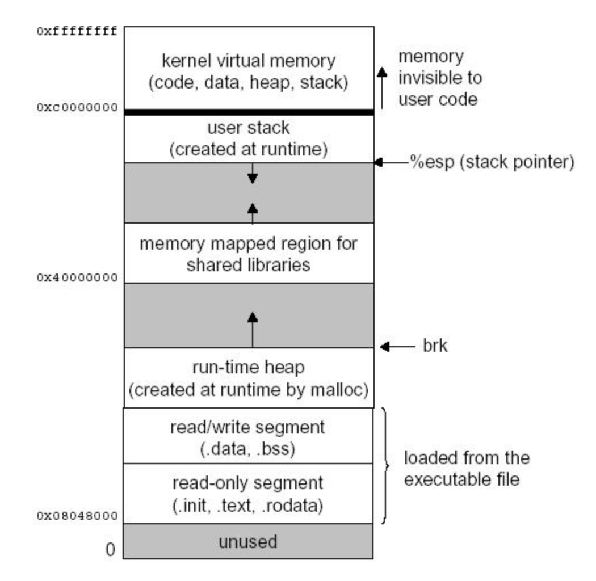

# 190904 운영체제 필기

Youtube [KUOCW] 최린 운영체제 (190904) 강의 [링크](https://www.youtube.com/watch?v=JaP6jnvE3RE&list=PLOh92BQ5xeWnjt_S9zLOtndYzUfysSuzF&index=2)

[그림 출처 - slideshare](https://www.slideshare.net/m25farid/chapter-02-9996884)

### Evolution of operating systems

운영체제의 역사.

#### 1) Serial Processing

초창기 컴퓨터 (1950년대 중반) 에는 OS가 없었음.

[앨런 튜링 (1912 ~ 1954)]

거의 모든 현대 컴퓨터의 발전은 국방으로부터 시작되었음. 2차 세계대전때 독일의 암호를 풀기 위해 개발된 것이 튜링의 Bombe 기계, 인터넷도 미국 국방성에서 알파넷이라는 프로젝트를 통해서 시작함.

이 때의 컴퓨터는 software이 없었음. 직접 플러그를 꽂았다 뺐다, 스위치를 올렸다 내렸다 하는 것으로 hardwired programming을 했어야 했음.

- 튜링 머신 : 현재 존재하는 모든 컴퓨터/디지털 시스템은 튜링 머신의 subset (1936)
- Bombe - 독일의 enigma를 풀기 위해 발명된 기계
- Turing test - 지금도 AI 판단을 위해 쓰임

[colossus (1943)]

1st programmable digital computer

[eniac]

탄도미사일의 궤적을 계산하기 위해 설계됨.

[폰 노이만]

요즘 사용하는 일반적인 PC는 다 폰 노이만 머신. program counter, memory address, register 등이 다 폰 노이만에 의해 정립되었음.

#### 2) Simple Batch Systems

- Batch system이란?

  기존에는 컴퓨터를 예약제로 사용해서 utilization이 매우 떨어졌다. 이를 개선하기 위해 GM에서 첫 운영체제가 1950년대 중반에 개발되었고, 이 OS를 batch system이라고 부른다. 

  미리 코드를 짜서 펀치카드로 만든 job을 전산실에 일렬로 배열해놓으면 담당자들이 batch로 차례대로 컴퓨터에 입력을 한다. monitor이라는 프로그램이 메모리 상에서 상주하고, input deck에 있는 카드를  하나씩 읽어서 처리한다. automatic job sequencing!

- Batch system의 단점

  여전히 processor utilization이 낮다. 왜? I/O device가 프로세서에 비해 매우 느리기 때문에. 많은 시간동안 I/O 작업을 기다리기 때문에 cpu의 활용률이 떨어지는 것.

#### 3) 개선된 multiprogrammed Batch system = multitasking

  어떤 job을 실행하다가 i/o를 요청하면, 그 i/o를 기다리는 시간에 다른 job을 읽어서 그 job을 먼저 처리함으로써 cpu utilization을 높이는 것.

#### 4) time sharing

여러명의 유저가 각자의 터미널을 통해 동시에 컴퓨터를 공유해서 사용할 수 있다. 

이 전까지는 process의 maximizing utilization을 최우선시 했다면 (설령 누구 하나가 오래 기다리더라도), 이제는 **response time을 최소화**시키는 것이 중요해졌다.

time sharing은 각 사용자에게 cpu를 full로 줘서 작업을 마칠 때 까지 기다리는게 아니라, 일정 시간(time slice)만 작업을 작업하게 하고, 순차적으로 돌면서 round robin으로 끝나게 하는 것.

이렇게 한 time slice 이후 다른 작업으로 변경하는 것을 **context switching**이라고 하고, 이렇게 switch 할 때 다음 실행할 program counter, register 상태 등을 그 프로세스의 process control block에 (메모리에) 저장 해 두어야 함. 그래야 아까 끝났던 곳에서 다시 시작할 수 있으니까.

- CTSS

  MIT에 의해 개발된 첫번째 Time sharing OS로, Project MAC이라고도 불린다. 36bit 프로세서,  resident monitor(OS)이 약 5000개의 word를 차지하면서 상주했다.

- time slicing

  system clock이 약 200ms마다 clock interrupt가 걸리면, 현재 실행중인 프로세서는 cpu를 release하고 잠시 중지되서 state를 저장한 후에 다른 job을 수행하는 것.

  이 당시에는 메모리에 한번에 한 job만 올라올 수 있었고, 기존 작업의 상태를 저장하려면 disk에 저장했어야 했다. 따라서 overhead가 컸다.

---

[여기서부터 본 수업]

### Process

[정의]

프로세스란? **실행중인 프로그램의 한 instance**.

프로그램과 프로세스는 다르다. 프로그램은 컴퓨터에 저장되어 있는 실행 가능한 파일. 그 안에 machine instuction들과 data가 들어있다. state를 가지지 않는 정적 파일이지.

하지만 프로그램을 실행하는 순간 걔는 프로세스가 된다. 하나의 프로그램을 여러번 실행시키면, 여러개의 프로세스가 실행되게 된다. 비록 같은 프로그램에서 시작되었지만 완전히 다른, 독립적인 객체들이다. 각각 자신의 virtual memory를 가지고 있고, cpu 자원을 할당받기 위해 기다린다. 정적인 프로그램과는 달리,  프로세스는 동적인 state와 lifecycle을 가진다.

[2 key abstractions]

1. Logical control flow: 프로세스는 OS에 의해 마치 자신이 processor을 독점적으로 사용하는 것 처럼 생각하게 된다. (사실은 multitasking)
2. Private address space: 프로세스는 메모리 역시 각자 고유의 메모리(virtual memory)를 가지고 있다고 생각한다. 다른 프로세스의 메모리는 생각하지 않음. 프로세스가 갖는 virtual memory는 실제 dram(= main memory = physical memory) 사이즈에 구애받지 않는다.

위와 같은 illusion이 가능한 이유는 **multiprogramming**과 (최근에는 멀티코어, 그 각각의 cpu 안에서는 round robin으로 timesharing으로 실행 - 다 병렬적으로 실행하는 것처럼 체감됨) **virtual memory** 덕분이다. virtual memory는 dram과 디스크에 의해 OS가 알아서 관리함. 실제 메인 메모리에서는 각 프로세스에서 현재 자주 필요로 하는 명령어와 데이터의 일부 페이지만 올라와 있고, 대부분은 디스크에 존재한다. 작은 메모리에서도 여러 프로세스의 일부분을 가지고 있으면서 illusion을 제공하는 거지!  

#### Private Address Spaces (virtual memory)

Physical address = 물리적인 dram 칩에서의 주소. 각 byte 마다 주소를 가진다.

Virtual address = virtual memory의 주소. cpu 안에서의 program counter, 명령어 주소, data 주소는 전부 다 virtual address이다. 

dram에 access 하기 전, hardware translation에 의해서 해당하는 private address space의 주소를 load된 dram의 주소로 실시간으로 변환해줌으로써 dram에 access 할 수 있다.

예를 들어 32bit processor 이면, 32bit의 가상 주소를 갖고, 32bit의 가상 주소면 각 주소가 byte이기에 2^32byte가 존재하는 것. 약 4GB 공간, `0x0000000` 부터 `0xfffffff` 까지!

아래 사진처럼 리눅스 같은 경우 user process가 약 가상 주소의 3/4정도를 사용하고, kernal(OS)이 약 1/4를 쓴다. 같은 프로세스 안에서 user code가 system call을 하면 커널 코드가 실행되고, 이런 식으로 user code와 kernal code가 반복되며 실행된다.

[출처](http://egloos.zum.com/harre/v/1695305)

Read-only segment: 사용자가 작성한 코드, constant로 define한 변수들

Read/write segment: global 변수, unintialized global 변수

위 2개의 공간은 static하게 항상 프로그램 실행 중 자리를 차지하고 있다. 아래 2개 공간은 dynamic하게 공간이 있다없다 그런다.

run-time heap: 런타임에 동적할당 된 변수들

stack: function 안에서 사용된 지역 변수들

#### logical control flow

실제로는 각 프로세스가 physically disjoint 하게 실행된다. time slice가 지나면 clock interrupt가 발생하고, context switching이 발생해서 상태를 저장하고 다른 프로세스를 실행한다.

하지만 프로세스 입장에서, 유저 입장에서는 병렬적으로 실행되는 것 처럼 보인다.

physically disjoint 하지만, logically parallel 한 경우 concurrent process라고 한다.

#### context switching

프로세는 OS의 커널에 의해 관리된다. 커널이란? 항상 실행되는 OS의 core을 커널이라고 생각하면 된다.

OS 커널은 독립적인 프로세스는 아니고, 하나의 프로세스 안에서 유저 모드, 커널 모드를 왔다갔다하면서 실행되는 것임.

mode bit이 set 되면 process는 kernal mode에서 실행되는 것 (모든 instruction, memory에 접근 가능), mode bit이 not set이면 user mode에서 실행되는 것 (previleged instuction에만 접근 가능).

그럼 언제 커널로 들어가냐? 커널로 들어가는 유일한 interface는 **exception**임. clock interrupt도 exception. system call도 exception.

그런데 커널로 들어갈 때, 그냥 들어가버리면 안됨. 다시 돌아올 때 같은 state에서 시작해야 하니까, 모든 context (PC, register)를 다 기록해야 함.

그리고 메모리에 준비되어 있는 여러 프로세스들 중에 어떤 것을 실행할지 결정하는 것이 스케줄링. 이런 스케줄링을 하는 코드를 scheduler 혹은 dispatcher 이라고 한다.