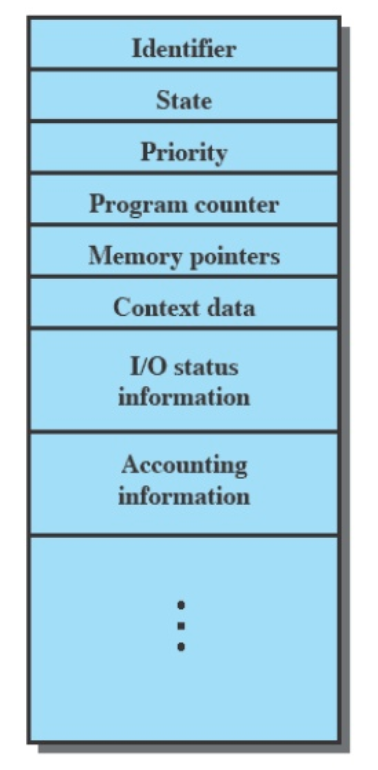
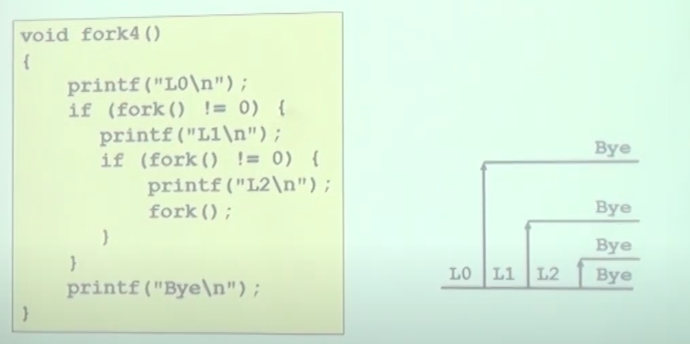
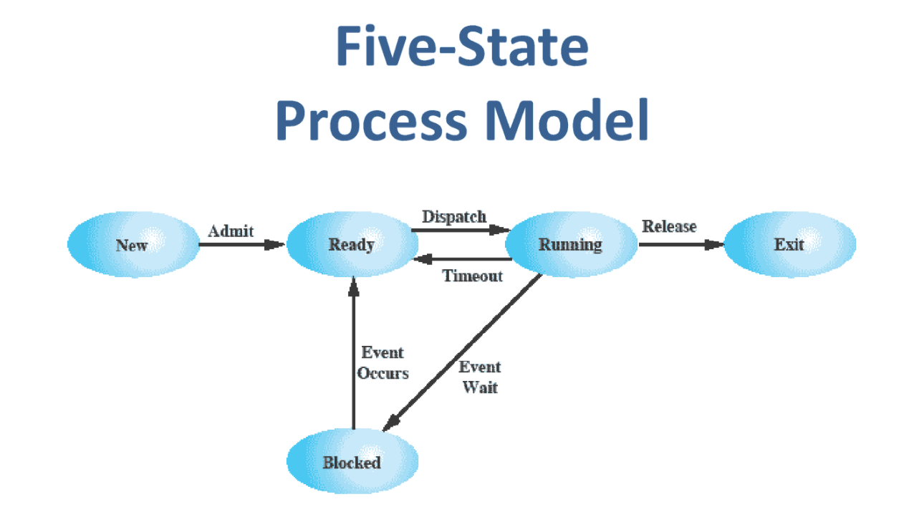
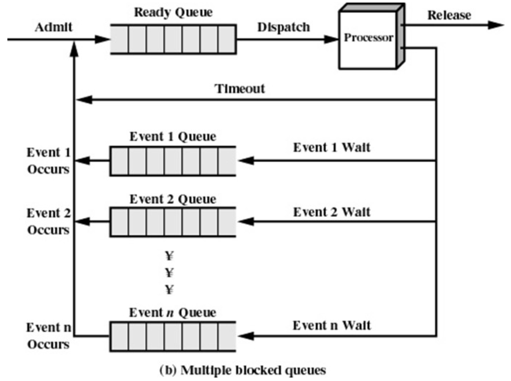
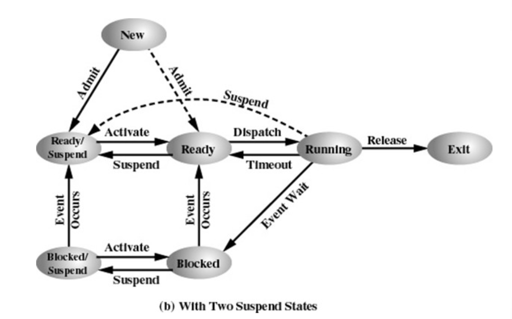

# 190909 운영체제 필기

Youtube [KUOCW] 최린 운영체제 (190909) 강의 [링크](https://www.youtube.com/watch?v=_NQrpp00OqY&list=PLOh92BQ5xeWnjt_S9zLOtndYzUfysSuzF&index=3)

### Process Control Block

multitasking 을 지원하기 위해선 운영체제에서 machine의 state를 관리해야 함.

컴퓨터는 sequential state system. 컴퓨터의 state는 크게 메모리(가상 메모리)와 레지스터(CPU 안에 있는 state)로 나뉠 수 있다. 레지스터의 state를 context라고 부른다.

context switching 할 때 기본적으로 OS가 하는 일은, 레지스터의 모든 state를 커널에 저장한다. 프로세스마다 레지스터 context를 포함해서 다양한 프로세스와 관련된 정보를 가지고 있는데, 이러한 정보를 일반적으로 아래와 같은 Process Control Block에 저장한다.



[사진 출처](https://www.slideshare.net/PeterTrger/06-processes)

커널에서 스케줄링을 담당하는 코드를 dispatcher 이라고 부른다.

### Process Creation and Termination

Process spawning: OS는 프로세스의 요청에 의해 새로운 프로세스를 생성할 수 있다. Fork를 요청하면 요청 주체인 프로세스는 Parent process, OS에 의해 생성된 프로세스는 Child process이다.

Proess termination: 프로세스가 끝나면 자동으로 끝나고, 다른 에러(ex. overflow, parent process termination)나 EXIT system call에 의해 프로세스가 종료되기도 한다.

#### fork

새로운 프로세스를 만들기 위해서는 fork 라는 system call을 사용한다.

fork는 1개의 프로세스에서 called 되었지만 2번 리턴한다. 동일한 코드가 fork 이후에는 parent, child에서 동시에 돌아간다! Parent process는 생성된 child의 pid(process id)을 리턴하고, child  process는 0을 리턴한다.

```c
void fork1(){
  int x = 1;
  pid_t pid = fork();
  if (pid ==0){
    printf("child has x = %d\n", ++x);
  } else {
    printf("parent has x = %d\n", --x);
  }
  printf("bye from process %d with x = %d\n", getpid(), x);
}
```

child는 x가 2, parent는 x가 0이 되겠지 :)

- parent and child both run the same code - 리턴값으로 부모자식을 구분할 수 있다
- duplicate but separate address space - 같은 state에서 시작하나 아예 별개의 프로세스이다. 각자 자신의 virtual memory를 갖는다.
- shared files - print 를 같은 파일에 한다.



parent, child는 계속해서 fork를 할 수 있다.

[사진 출처](https://www.youtube.com/watch?v=_NQrpp00OqY&list=PLOh92BQ5xeWnjt_S9zLOtndYzUfysSuzF&index=3)

#### exit

프로세스를 종료시키기 위해서는 exit을 사용한다.

normal termination은  `exit(0)` 이다.

`atexit()` 이라는 함수도 있는데, 이 함수는 나중에 exit 할 때 실행할 function들을 미리 register 할 수 있다.

```c
void cleanup(void){
  printf("cleaning up\n");
}

void fork(){
  atexit(cleanup);
  fork();
  exit(0);
}
```

atexit으로 이후 실행할 작업을 등록하고, exit 이후에 cleanup이 실행된다.

### Five state Process Model

간략하게 Process의 state를 5개로 나타낼 수 있다.



[출처](https://www.docsity.com/en/processes-two-operating-systems-lecture-slides/293508/)

Ready Queue: 메모리에 있고, 아무것도 기다리는게 없고, 실행할 준비가 되어 있는 프로세스들이 대기하는 queue

Block (Event) Queue: 각각의 I/O 리소스마다 이벤트가 다름. 각 이벤트 마다 이런 Block Queue가 존재하게 됨.



[출처](https://slideplayer.com/slide/4936182/)

### Suspended Process

#### Swapping

실행 중인 모든 프로세스가 I/O 요청을 기다리고 있고, 메모리도 꽉 찼다고 가정하자. CPU가 새로운 프로세스를 할당하려고 봤는데 모든 프로세스가 Block 상태면? CPU가 놀게 된다.

이럴 땐, 강제로 Block 상태에 있는 프로세스들을 메모리에서 디스크로 쫒아낸 뒤, 새로운 프로세스가 들어올 수 있도록 한다. 이렇게 해서 CPU utilization을 높일 수 있다. 이게 swapping.

#### Suspended Process

OS에 의해 메모리에서 디스크로 쫒겨난 상태. 메모리에 있지 않으므로 실행될 수 없는 상태이다. 얘는 위의 5가지 state가 아닌 suspended state라는 별도의 state를 갖게 된다.

[Process state model with two suspended states] - 좀 더 현실적인 형태



ready 상태인데 쫒아낼 수도 있고, blocked 상태인데 쫒아낼 수도 있다.

### Exception / Interrupt

Exception 과 Interrupt 는 메커니즘은 비슷하지만, 발생 원인이 아예 다르다.

**Exception** : 현재 CPU에서 실행 중인 프로세스의 특정 명령에 의해서 CPU **내부**에서 발생하는 이벤트. Syncronous 하다. 같은 코드를 실행하면 항상 같은 Exception이 발생한다.

ex. page fault (해당하는 메모리 주소에 해당하는 명령어가 없을 때 - 프로세스는 중단되고 OS가 관여해서 디스크에서 가져와야 함)

- Falut: Unintentional but possibly recoverable. 해당 명령어를 마치지 못하고 빠져나간 것. 이후 다시 돌아왔을 때 "current" instruction 부터 다시 실행 (ex. page faults, divide by zero)
- Trap:  Intentional exception. Debug 같은 것. 명령어를 마친 후 프로세스에서 빠져나오므로 다시 시작할 때 해당 명령어의 "next" instruction 부터 다시 실행.
- Abort: Unintentional and urecoverable.

**Interrupt** : 현재 CPU에서 진행 중인 일과 아무런 상관이 없는 **외부**적인 이벤트. Asyncronous 하다. 언제 어디서 발생할 지 모른다. ex) KeyboardInterrupt, 하드웨어 전원 리셋, 노트북 화면 꺼짐 등등...

Exception이나 Interrupt 가 발생하면 현재 CPU가 실행중인 프로세스는 중단되고, 특정 이벤트를 관리하기 위한 핸들러 코드가 실행된다.

