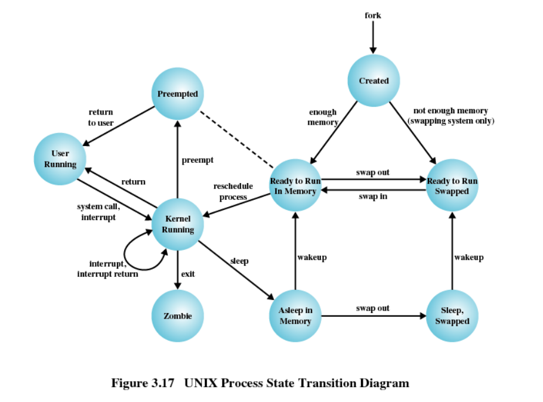
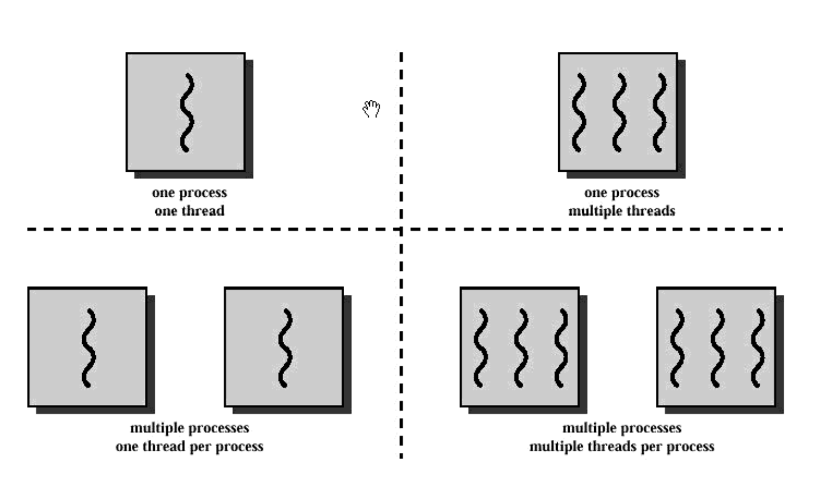
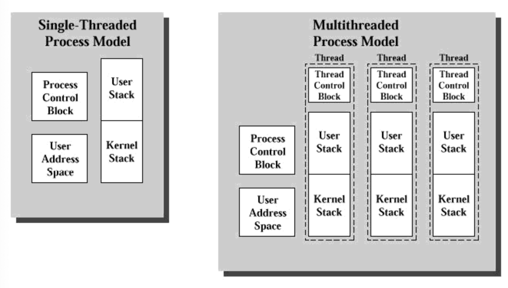

# 190911 운영체제 필기

Youtube [KUOCW] 최린 운영체제 (190911) 강의 [링크](https://www.youtube.com/watch?v=MCJvDdhJW_Y&list=PLOh92BQ5xeWnjt_S9zLOtndYzUfysSuzF&index=5)

### Exception / Interrupt

interrupt도 광의의 exception.

[복습]

OS에서 커널 코드로 들어가는 모든 경우는 interrupt, exception이다.

Exception은 synchronous, Interrupt는 asynchronous (CPU 안의 clock cycle과는 완전히 무방)하다. 하지만 예외적인 상황이 언제 발생할 지 모르기 때문에 cpu는 매 cycle 마다 Exception / Interrupt 가 발생하는지 확인한다. 예외적인 상황이 발생했을 경우 실행중이었던 프로세스를 잠시 중단하고, 핸들러를 실행시킨다.

프로세스 중단(suspend)은 context switching과 유사하게, pc값과 모든 레지스터 상태들도 커널의 process control block의 process context에 저장된다. 다음 pc값은 핸들러의 값이 되겠지! exception vector, interrupt vector에 의해 handler의 주소가 pc에 할당되면서 핸들러가 실행되는 것.

recovery가 잘 되면 아무 일 없었던 것처럼 resume 되고, recovery가 불가능하다면 현재 실행중이었던 process는 terminate 된다. recovery가 불가능한 exception의 예제는 arithmatic exception (NAN, devide by zero등), protection violation (Read only인데 write 하려고 한다던지)...

#### (Synchronous) Exception

- Trap: ex) system call, breakpoints(debug) - 의도적이고, 돌아올 때 next inst부터 재실행.
- Fault: 의도적이지 않고, 현재 inst를 완료하지 못했기 때문에 돌아올 때 현재 inst부터 재실행.
- Aborts: 의도적이지 않고 unrecoverable 한 것. 대개는 hardware error. ex) parity error

#### (Asynchronous) Interrupt

CPU 외부적인 특정 이벤트가 발생시킨 것.

CPU에는 2개의 interrupt pin이 (#INT - disable 시킬 수 있는, maskable interrupt, #NMI - disable 할 수 없는 우선순위 높은 interrupt) 있다.

[예시]

- I/O interrupt
- Hard reset interrupt (리셋 버튼 누르는 것)
- Sort reset interrupt (ctl-alt-delete 누르는 것)

---

### UNIX System V Process Management

#### process의 2가지 종류

**System Process**

- 커널 모드에서 돌아가며 OS 코드를 실행한다
- Memory allocation, process swapping 등의 administrative, housekeeping 기능들을 수행한다. 

**User Process**

- usermode에서 돌아가며 user program을 실행한다.
- System call이나 exception,interrupt 등에 의해 커널 모드로 왔다갔다 한다.

#### UNIX System V의 process states

앞서 배웠던 것 보다 조금 더 복잡한 process states를 갖는다. swap이 suspend랑 같은 상태 (메모리 밖으로 쫒겨난 것)

user mode랑 kernal mode랑 분리했다.

[사진 출처](http://www2.cs.uidaho.edu/~krings/CS240/Notes.F13/240-13-06.pdf)

----

지금까진 Process를 다룸. 지금부턴 Thread!

## Ch.4 Threads

우리가 다룰 Thread는 **운영체제의 Thread**를 의미한다. = lightweight process

참고) 요즘에 인텔에서 hyperthread를 쓰는 프로세서들에서 말하는 Thread는 하드웨어의 Thread를 의미하는 완전 별개의 개념이다. 매 싸이클마다 실제로 2개의 process를 동시에 실행하는 것. 따라서 여기서 얘기하는 Thread는 독립적인 Process.

지금까지는 프로세스가 single thread of control로 실행된다고 가정했지만, 대부분의 모던 컴퓨터에서 실행되는 sw application은 **multithreaded**다. 한 프로그램이지만, 여러개의 코드가 번갈아가면서 실행되거나 병렬적으로 실행되는 것. multiprocessing의 장단점이 있고, multithreading의 장단점이 있다. 이 둘을 번갈아가면서 쓴다고 한다.

[multithread의 implementation 예시]

- 웹 브라우저는 여러개의 thread를 활용해 서로 다른 탭을 보여준다. (한 탭에서는 네이버, 한 탭에서는 유투브)
- 워드프로세서는 한 쓰레드는 화면을 보여주고, 하나는 키보드 인풋을 받고, 하나는 grammar check를 하고, 하나는 디스크에 저장하고...등등등
- 웹 서버는 remote에서 오는 여러개의 http request에 대해 각각 새로운 쓰레드를 만들어서 응답할 수 있다. 프로세스를 fork 해서 각각의 request에 응답할 수도 있지만, 프로세스는 헤비한 반면 (메모리도 각자 가지고 있고, 자원도 각자 가지고 있다 - resource intensive) 쓰레드는 가볍다(메모리도 공유하고 자원도 공유한다). 따라서 훨씬 효율적으로 웹 서버를 구현할 수 있다.

### Process Characteristics

**1) Resource ownership**

프로세스는 리소스를 가지고 있는 주체가 된다. 메모리, CPU, I/O device, files 등... 리소스는 제한되어 있는데, 프로세스들은 리소스를 사용하기 위한 경쟁 관계에 있다. OS는 이 리소스를 프로세스들에게 mutually exclusive하게 제공하기 위해 protection을 제공해야 한다.

또한, 프로세스는 각각의 virtual address space를 갖는다.

**2) Scheduling unit**

지금까지 OS에서 scheduled 되고 dispatch 되는 단위는 process였다. (Ready, run, block, suspend 등....) 그리고 프로세스 단위로 스케줄링 될 때의 우선순위가 있었다.

이제는 1.resource ownership 은 그대로 프로세스가 가져가되, 2를 쓰레드 단위로 보겠다는 것.

### Multithreading

멀티쓰레딩이란? OS가 하나의 프로세스 내에서 multiple concurrent paths of execution을 지원하는 능력.

Process 는 resource allocation and protection의 단위이고, Thread는 실행의 단위이다. (unit of dispatching) 다만, thread는 제한된 state를 갖는다. process처럼 suspend 되진 못함.

요즘 운영체제는 다 멀티쓰레딩 되어있다.

[사진 출처](https://sungjk.github.io/2015/11/29/Process-Thread.html)

#### multithreaded process model

**Process** : unit of resource allocation & protection and has

- virtual address space
- protected access to processors, files, and I/O devices

**Each thread within a process** : has

- Thread control block - thread context (pc, stack pointer 같은 레지스터 값들), thread state(block 상태인지...등등), priority를 비롯한 thread-relate state information
- execution stack (user stack, kernal stack)

**All the threads of a process**:

- share the same address space and share the resources of that process - 쓰레드 간에서 소통하려면 그냥 메모리에 읽고 쓰면 됨. 프로세스들 간의 통신보다 훨씬 쉬움.

#### Threads vs. Processes

[출처](https://users.cs.cf.ac.uk/Dave.Marshall/C/node29.html)

multithreaded 환경에서는 각 쓰레드 별로 thread control block에 다양한 상태정보를 기록하고, stack을 독립적으로 관리한다.

#### Advantages of Multithreading

**Lightweight!**

- 프로세스 생성보다 쓰레드 생성이 더 빠르다.
- 끝내는 것도 쓰레드가 더 빠르다.
- context switching 하는 것도 쓰레드가 더 빠르다.
- 서로 커뮤니케이션하는 것도 쓰레드가 더 빠르다. (메모리를 공유하므로 read/write하면서 커널을 거치지 않고도 통신할 수 있다.)

**Faster Response**

프로세스의 한 part가 block되어도 다른 쓰레드가 다른 작업을 실행할 수 있다.

**Parallel Processing**

멀티코어를 최대한 활용할 수 있다. 싱글쓰레드면 멀티코어여도 해당 application의 성능자체는 영향이 없다.

#### Multithreaded applications 예시

File server

- 새로운 파일 리퀘스트 하나마당 쓰레드 하나만 spawn하면 됨
- multiprocessor environment에서는 여러 cpu에 하나의 프로세스의 여러 쓰레드가 동시에 돌아가므로 multicore의 성능을 활용할 수 있다.
- coordination이 훨씬 쉽고, file sharing이 쉬워진다.

### Thread State

- Ready, run, blocked
- suspend는 없다. 오직 process-level state임.

state에 영향을 미치는 쓰레드 operation은 다음과 같다.

1. spawn: 쓰레드를 생성하는 것. 하나의 프로세스가 생성되면 기본적으로 single thread가 만들어지고, 그 thread에서 다른 thread를 spawn 할 수 있다.
2. Block: I/O를 요청하는 등의 이벤트를 기다릴 때는 block 된다. block될때는 자신의 상태를 저장하고 프로세스는 다른 ready 상태의 쓰레드로 swich 하거나, 다른 process로 switch 한다.
3. unblock: 이벤트가 발생하면 block에서 ready로 가고
4. finish: 작업 끝나면 상태 deallocate

