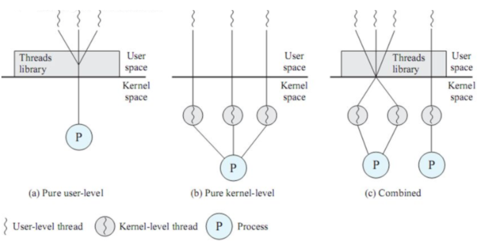
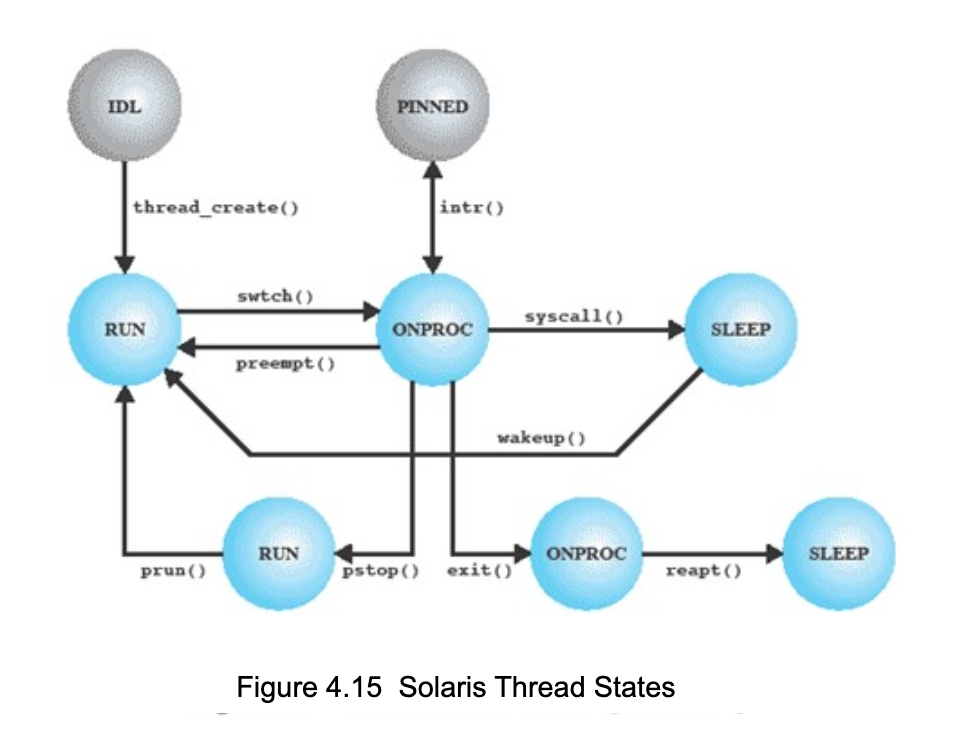

# 190916 운영체제 필기

Youtube [KUOCW] 최린 운영체제 (190916) 강의 [링크](https://www.youtube.com/watch?v=tkVF4E3H_M4&list=PLOh92BQ5xeWnjt_S9zLOtndYzUfysSuzF&index=4)

프로세스를 한번 fork 하게 되면, virtual memory를 독자적으로 갖고, system call을 통해 OS kernal을 요청하는 것이기 때문에 오버헤드가 굉장히 크다.

반면 쓰레드는 system call 없이 user level에서 할 수 있기 때문에 훨씬 빠르다. (OS 왔다갔다하는 오버헤드가 없어서) 또한, 쓰레드는 같은 자원을 공유하기 때문에 쓰레드 별 communication이 훨씬 빠르다. 따라서 멀티 태스킹을 좀 더 효율적으로 할 수 있는 것이다. concurrent processing, faster response.

### User Level Threads (ULT)

모든 쓰레드 관리는 application에 의해 이뤄진다. user-level의 threads library에서 모든 관리를 하는 것.

[ULT의 장점]

- context switching이 빠르다
- scheduling algorithm이 OS의 관여 없이 어플리케이션 라이브러리 차원에서 최적화시킬 수 있다. 특정 어플리케이션은 그냥 round robin 스케줄링, 다른 어플리케이션은 priority 스케줄링 등으로!
- OS와 상관이 없으므로 underlying kernal에 어떠한 변화도 요구되지 않는다. 

[ULT의 단점]

- Thread의 장점을 온전히 활용하지 못한다. 어떤 thread가 system call을 하게 되면 해당 thread뿐만 아니라 process 내의 모든 thread가 block 된다.
- multithreaded application이더라도 실제로 multiprocessing 의 장점을 활용할 수 없다. 하나의 프로세스를 하나의 코어에만 할당할 수 있기 때문에.

### Kernal Level Threads (KLT)

[장점]

Thread의 장점들을 완벽히 다 살리려면 OS 레벨에서 쓰레드를 지원해야 한다. Thread management가 application이 아니라 kernal에 의해 이뤄지는 것.

Thead는 system call에 의해 만들어지고, 한개의 thread가 block되도 다른 thread를 실행할 수 있다.

[단점]

- 쓰레드 생성, 쓰레드 전환 및 모든 작업을 kernal에 계속해서 요청해야하기때문에 오버헤드가 크다. ULT에 비해 10배 이상.

### Combined Approach

ULT랑 KLT를 섞어!

[이미지 출처](https://www.crocus.co.kr/1255)

Thread creation은 User level에서, system call, parellel processing이 필요한 경우에만 상응하는 KLT에 매핑!

잘 설계된다면 ULT, KTL의 장점을 둘 다 살릴 수 있다.

### Performance Impact of Multicores

Moore's law: IC 칩에 집적할 수 있는 transistor의 수가 1년반에 2배, 3년에 4배씩 증가한다는 것. (컴퓨터에서는 성능이)

Amdahl's law: inherently serial 한 fraction이 전체 application의 성능을 좌우한다.

### Applications for multicores

- Multithreaded native applications (적은 process, 각각의 process가 highly multithreaded)
- Multiprocess Applications
- Java applications (single process, multithreaded)

### Solaris

운영체제의 할아버지는 UNIX (60년대 말, 70년대 초반...).

UNIX 중 가장 유명한 상용 운영체제가 Solaris.

Solaris에는 4가지 thread-related objects가 있다.

1) Process: virtual memory, process control block을 가지고 있다.

2) User-level thread (ULT)

3) Ligntweight process (LWP) - ULT를 Kernal tread에 매핑해주는 애. 독립적으로 커널에 의해 scheduled 되고, multiprocessor 환경에서 실행될 수 있다.

4) Kernal Thread

### Solaris Thread States

[사진 출처](https://slideplayer.com/slide/6931097/)

----

지금부터는 Concurrency!

## 5. Concurrency: Mutual Exclusion and Synchronization

### Process Interaction

Single processor system에서는 여러 프로세스들이 CPU utilization을 위해 interleave(상호 배치)된다. 이렇게 concurrent 하게 실행됨으로써 아래와 같은 문제점을 발생시킨다.

- mutual exclusion
- deadlock
- starvation
- rave condition 

Multiprocessor system에서도 위와 같은 문제들이 발생한다.

### competing process

프로세스들 간의 글로번 자원에 대한 경쟁으로 인해 아래와 같은 문제점이 발생한다.

- need for mutual exclusion
- deadlock
- starvation

#### mutual exclusion

2개의 프로세스가 둘 다 하나의 printer을 사용해야 한다고 가정하면, 2개의 프로세스가 한 줄 한 줄 프린트 되는 것은 원치 않으므로 한 프로세스가 프린터 사용 시 그 프로세스만 프린터 리소스에 접근할 수 있어야 한다.

이를 **critical section**이라고 한다. mutual exclusion을 보호해야 하는 영역. interrupt pin을 disable, enable 시켜서 보장할 수 있다.

