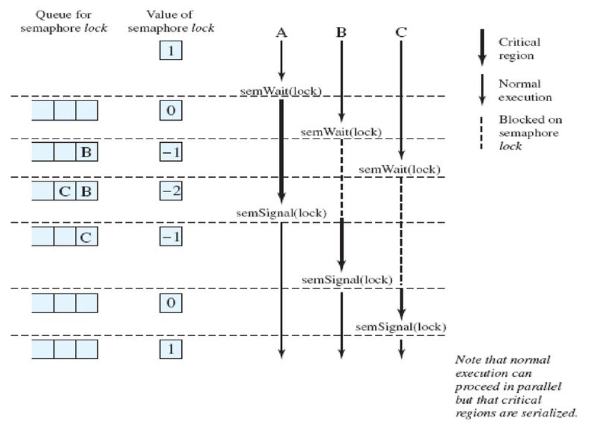

# 190918 운영체제 필기

Youtube [KUOCW] 최린 운영체제 (190918) 강의 [링크](https://www.youtube.com/watch?v=oTIp836P0-w&list=PLOh92BQ5xeWnjt_S9zLOtndYzUfysSuzF&index=6)

### Competing Processes

프로세스들이 글로벌 자원을 공유하므로 아래와 같은 문제들이 생길 수 있다.

- need for mutual exclusion
- deadlock
- Starvation

#### deadlock

프로세스 p1, p2가 각각 자원 r1, r2를 가지고 있으면서, 서로 자신의 자원은 놓지 않으면서 상대 자원을 기다리는 것. 영영 기다리기만 할 뿐 자신의 자원을 놓지 않으므로 deadlock이 발생한다.


#### starvation (infinite postponement)

3개의 프로세스 p1, p2, p3이 있고, 자원 R에 대해 경쟁할 때, OS (scheduler) 가 p1, p2에만 자원을 줘서 p3가 영영 자원을 기다리는 것. p3는 starvation 을 겪게 된다.

#### race condition

경쟁하는 관계가 아니라, **협력하는 관계**의 프로세스(혹은 쓰레드)에서 생길 수 있는 문제.

자원과는 상관 없고, shared data (global data)에 의해 의도하지 않은 결과가 나오는 것을 race condition이라고 한다.

같은 작업을 하도록 설계된 프로세스 p1, p2가 서로 Interleaving되면서 의도하지 않은 다른 결과를 가져올 수 있다.

2개 이상의 프로세스 혹은 쓰레드가 shared data를 동시에 업데이트 하려고 함으로써 원하지 않은 결과를 불러일으키는 것을 race condition이라고 한다. thread/process scheduling 알고리즘이 non-deterministic 하기 때문에 (interrupt 등에 의해) 어떤 thread/process 가 먼저 shared data에 먼저 접근할지 알 수 없다. 

따라서 shared data에 operation을 하는, mutually exclusive해야 하는 부분을 critical section으로 보호하지 않으면 collision이 일어날 수 있다. (특징: non-deterministic, not reproducible)

### Concurrency: key terminologies

[Mutual exclusion을 어떻게 보장할 것이냐? Critical section 을 어떻게 보호할 수 있냐?]

**critical section**: a section of code within a process that requires access to shared resources and that must not be executed while another process is in a corresponding section of code.

프린터는 프린터대로, 키보드는 키보드대로... 같은 리소스는 같은 변수로 보호해두어 하나의 프로세스/쓰레드만 진입할 수 있도록 한다.

[Critical section 을 어떻게 구현할 것이냐?]

processor이 1개인 경우 - critical section에 들어갈 때 interrupt 을 disable, 나올 때 interrupt를 able 시키면 된다. 그런데 이 방법은 multiprocess 환경에서는 통하지 않음. 

general 한 경우 - **atomic operation** 을 사용한다.

**atomic operation** : 2개 이상의 instruction으로 구성되어 있지만, **indivisible**하다. 전체를 다 하거나, 아예 안하거나 (all or nothing). 이런 atomic operation을 사용해서 concurrent process 간의 mutual exclusion을 구현할 수 있다.

### Atomic Operation

- indivisible, uninterruptable.

- success이거나, failure이다. 중간은 없다.
- 대부분의 프로세서들이 HW-level의 atomic operation을 가지고 있다.
  - Test-and-set, fetch-and-add, compare-and-swap, load-link, store-conditional

- SW-level solutions : atomic machine instruction을 활용해서 구현한다.

#### HW support for mutual exclusion

**[uniprocessor인 경우]**

방법: interrupt를 disable 함으로써 simple하게 구현한다.
```pseudocode
While (true) {
/* disable interrupt */
/* critical section */
/* enable interrupt */
}
```

단점: 그냥 막는거라서 performance 상의 단점이 있고, uniprocessor 일때만 가능한 방법이다.

**[general 한 경우 - including multiprocessors]**

Special machine instruction을 사용한다. Atomic operation을 사용해서!

Access to shared memory location이 exclusive, atomic 하도록 보장한다.

이러한 Atomic operation을 사용해서 semaphores나, 다른 sw solution에도 사용할 수 있다.

단점: busy waiting (critical section에 못들어가는 상태면 계속해서 test and set...반복...), deadlock, starvation이 일어날 수 있다.

#### "compare and swap" instruction

```pseudocode
int compare_and_swap (int *word, int testval, int newval) {
	int oldval;
	/* 이전 값을 oldval에 저장하고 */
	oldval = *word
	/* 이전 값이 testval이면 새로운 값을 저장 */
	if (oldval == testval) *word = newval;
	/* 메모리 값 리턴 */
	return oldval;
}
```

memory에 있는 값을 새로운 값(newval)으로 교환하려고 하는 코드.

[compare and swap을 활용해 critical section 구현하기]

```pseudocode
const int n = /* number of processes */
int bolt;
void P(int i) {
	while (true) {
		/* bolt 값이 0인지 compare 하고, 0이면 1로 바꾼다. */
		while (compare_and_swap(&bolt, 0, 1) == 1) {
			/* do nothing */
		}
		/* critical section */
		bolt = 0;
		/* remainder */
	}
}

void main() {
	bolt = 0;
	parbegin (P(1), P(2), ...., P(n)) /* 동시에 시작 */
}
```

bolt = memory location. (lock 변수 - 얘를 lock 하는 애만 critical section에 들어가고 나머지는 기다린다.)

처음 scheduled 된 애만 `bolt = 0` 을 보고, compare_and_swap 값을 1로 바꾼 뒤 0이 리턴되므로 while 문을 빠져나와 critical section에 들어간다.

나머지 애들은 전부 다 `bolt = 1`을 보기 때문에 busy waiting을 한다.

아까 critical section을 빠져나와 bolt를 0으로 바꾸는 순간 또 한 명만 `bolt = 0` 을 본다. 이런 방식으로 mutual exclusion을 보장할 수 있다.

#### "exchange" instruction

memory 값을 자기가 준비한 register 값으로 변경하는 것.

```pseudocode
void exchange (int *register, int *memory) {
	int temp;
	temp = *memory;
	*memory= *register;
	*register = temp
}
```

[exchange를  활용해 critical section 구현하기]

````js
const int n = /* number of processes */
int bolt;
void P(int i) {
  int keyi = 1;
	while (true) {
		/* 1을 1로 계속해서 exchage 하는 것 */
		do exchange (&keyi, &bolt)
    while (keyi != 0){
			/* do nothing */
		}
		/* critical sec tion */
		bolt = 0;
		/* remainder */
	}
}

void main() {
	bolt = 0;
	parbegin (P(1), P(2), ...., P(n)) /* 동시에 시작 */
}
````

처음 bolt가 0인 애만 key(1)와 bolt(0)을 exchange 하고, critical section에 들어간다.

나머지 애들은 계속해서 1을 1로 exchange 하는 것.

critical section을 빠져나오면서 bolt를 다시 0으로 바꾸면, 다시 한 애만 bolt = 0 을 보고 exchange를 해서 critical section에 들어간다.

#### special instruction의 장단점

Atomic instruction을 쓰면 뭐가 좋은가!

[장점]

- 프로세서의 수에 상관 없이 사용할 수 있다. (single processor 이든, multiple processors 이든.)
- 여러개의 critical section을 구현할 수 있다. 서로 다른 리소스(키보드, 프린터...)를 다른 변수로 보호할 수 있는 것.

[단점]

- Busy-waiting
- selection of a waiting process가 임의적이기 때문에 starvation과 deadlock 이 발생할 수 있다.

다 단점이 있네.... 그래서 이상적인 소프트웨어적 메커니즘으로 제안된 것이 **Semaphore**!

### Semaphore

**정의**: A variable that provides a simple abstraction for controlling access to a common resource in a programming environment. implicit하게는 자원의 갯수라고 생각하면 됨.

[semaphore 변수의 value는 오직 2가지 operation에 의해 변경된다]

- **V operation** (=signal): **increment** the semaphore - release 하는 것
- **P operation** (=wait): **decrement** the semaphore - 요청하는 것

(추가적으로 초기화하는 Operation도 있다.)

semaphore의 값, S는 일반적으로 현재 사용 가능한 resource unit의 개수이다.

**semaphore의 종류**

- binary semaphore (1 or 0)
  - 0일때는 locked, unavailable
  - 1일때는 unlocked, available
- counting semaphore (n개 - 자원의 개수)

이론적으로는 binary로 다 할 수 있지만 어렵기 때문에 counting semaphore을 더 많이 쓴다.

#### semaphore primitives (counting semaphore)

아래와 같은 구조의 data structure이 있다면 critical section을 구현할 수 있다. busy waiting이 없는 대신, queue가 있다.

```C
struct semaphore {
  int count;
  queueType queue;
};
void semWait(semaphore s) {
  s.count--;
  /* 감소했는데 음수 : 즉 resource가 없다는 것 - queue로 들어간다 */
  if (s.count <0){
    /* place this process in s.queue */
    /* block this process */
  }
}
void semSignal(semaphore s) {
  s.count++;
  /* 증가했는데 음수 : 즉 그 전에 음수였다면 - queue에 있는 애를 하나 빼서 ready 시킨다. */
  if (s.count <= 0){
    /* remove a process P from s.queue */
    /* place process P on ready list */
  }
}
```

#### binary semaphore

```c
struct semaphore {
  enum (zero, one) value;
  queueType queue;
};
void semWaitB(binary_semaphore s) {
  if (s.value == one) s.value = zero;
  else {
    /* place this process in s.queue */
    /* block this process */
  }
}
void semSignalB(binary_semaphore s) {
  if (s.queue is empty()) s.value = one;
  else {
    /* remove a process P from s.queue */
    /* place process P on ready list */
  }
}
```

s.value == 0 이라는 상태만 가지고서는 누가 대기하고 있는지 아닌지를 구분할 수 없다.

대기하고 있는 애가 없으면 1로 만들어주지만, 대기하고 있는 애가 있으면 걔를 먼저 깨워줘야 한다.

#### strong/weak semaphores

strong semaphore: FIFO 방식의 queue로 애들을 깨운다면 (oldest first) strong semaphore

weak semaphore: 그냥 waiting 하고 있는 애들 중 아무나 깨울 수 있다면 weak semaphore

#### semaphore 로 mutual exclusion 구현하기

```pseudocode
const int n = /* number of processes */
semaphore s = 1;
void P(int i) {
	while (true) {
		semWait(s);
		/* critical section */;
		semSignal(s);
		/* remainder */;
	}
}

void main() {
	parbegin (P(1), P(2), ...., P(n)) /* 동시에 시작 */
}
```

#### shared data protected by a semaphore



[자료 출처](https://slideplayer.com/slide/14913352/)

critical section에서는 concurrent 하지 않게, 순차적(serial)으로, mutually exclusive하게 실행됨을 볼 수 있다. 추가적으로, normal execution은 parallel 하게 실행되는것 역시 확인할 수 있다.

